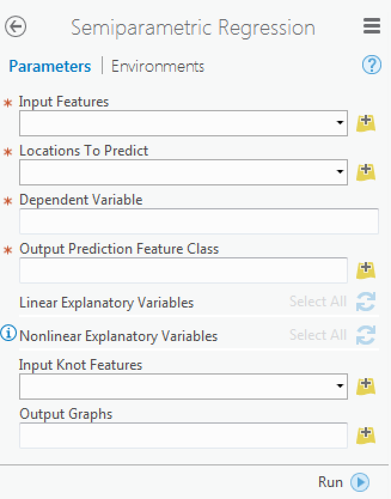

% R-ArcGIS Bridge and the Microsoft DSVM
% Shaun Walbridge

<section data-background="images/title.png">
<h2>[https://github.com/scw/r-ms-uc-2017](https://github.com/scw/r-ms-uc-2017)</h2>
<h3>[High Quality PDF (2MB)](https://4326.us/esri/r-ms-uc-2017/uc-2017-r-ms-full.pdf)</h3>
</section>

Related Sessions {data-background="images/title.png"}
----------------

 - [Data Science Made Easy in ArcGIS Using Python and R](https://userconference2017.schedule.esri.com/schedule/345927268)
    + Tomorrow, 8:30&ndash;9:45a, Room 07 A
    + ArcGIS + Python + R + Jupyter Notebooks for analysis

 - [Bridging the Gap: Integrating R and ArcGIS for Advanced Analysis](https://userconference2017.schedule.esri.com/schedule/1087523793) 
    + Tomorrow, 10:00&ndash;10:30a, Tech Theater 17
    + **Deeper dive** into using R with ArcGIS

Data Science {data-background="images/bg-1.png"}
============

Data Science Languages {data-background="images/bg-1.png"}
----------------------

 - {class="tight" style="width:32px"}  Python (SciPy stack, Jupyter, scikit-learn, ...)
 - C++ (CNTK, Tensorflow)
 - {class="tight" style="width:32px"} **R** ([AI task view](https://cran.r-project.org/web/views/MachineLearning.html))
 - Many workflows require combining components from multiple environments

. {class="tight"} {data-background="images/bg-1.png"}
-----

* [Continuum Analtyics](https://continuum.io) &mdash; open data science company
* Initially Python &mdash; expanded to many languages
* Supported in:

    + ArcGIS Pro 1.3+
    + Microsoft DSVM

Conda in ArcGIS Pro {data-background="images/bg-1.png"}
-------------------

. {class="tight"}

SciPy in ArcGIS {data-background="images/bg-1.png"}
---------------

. {class="tight" style="margin-top: -150px"}

ArcPy {data-background="images/bg-1.png"}
-----

 - Python module for accessing all the capabilities of ArcGIS Pro from within Python
 - Chaining tools together, form models and scripts
 - Primary mechanism for extending the software for desktop users

ArcGIS API for Python {data-background="images/bg-1.png"}
---------------------

 - Jupyter: Python, R and remote data sources

. {class="tight"}

R {data-background="images/bg-1.png"}
=

Esri and {class="tight" style="width: 96px"}? {data-background="images/bg-1.png"}
------

 - Integration via ArcGIS&ndash;R bridge, last two years
 - Joined [R Consortium](https://www.r-consortium.org/) and [R Foundation](https://www.r-project.org/foundation)

Why {class="tight" style="width: 96px"}? {data-background="images/bg-1.png"}
------

 - Powerful core data structures and operations
    + Data frames, functional programming
 - Unparalleled breadth of statistical routines
    + The _de facto_ language of Statisticians
 - `CRAN`: 6400 packages for solving problems
 - Versatile and powerful plotting

R &mdash; ArcGIS Bridge {data-background="images/intro-bg.jpg"}
=======================

Delicate Arch at Night: https://commons.wikimedia.org/wiki/File:Delicate_Arch_at_Night_%288708111489%29.jpg

R &mdash; ArcGIS Bridge {data-background="images/bg-1.png"}
-----------------

. {class="tight"}

R &mdash; ArcGIS Bridge {data-background="images/bg-1.png"}
---------------

{style="border: none"}

 - ArcGIS developers can _create tools and toolboxes_ that integrate ArcGIS and R
 - ArcGIS users can _access R_ code through geoprocessing scripts
 - R users can _access organizations GIS' data_, managed in traditional GIS ways

[https://r-arcgis.github.io](https://r-arcgis.github.io/)

R &mdash; ArcGIS Bridge {data-background="images/bg-1.png"}
---------------

 - Store data with ArcGIS, access it in R, return R objects back to ArcGIS native data types (e.g. geodatabase feature classes)
 - Knows how to convert spatial data to `sp` objects, R native spatial data type

Building R Script Tools {data-background="images/bg-1.png"}
-----------------------

{class="tight" style="height:32px"}

{style="height:500px;"}

R: Demo {data-background="images/bg-1.png"}
-------

What's next? {data-background="images/bg-1.png"}
------------
 - Raster support (come see it in action tomorrow)
 - Simple features (`sf` package)
 - Scaling with Azure

DSVM Integration {data-background="images/bg-1.png"}
================

DSVM Integration {data-background="images/bg-1.png"}
----------------

 - ArcGIS Pro in Azure 
 - Data Science and Deep Learning machines (high performance)
 - A _unified environment_ for AI problem solving &mdash;
   + Provides an in-depth solution &ndash; the latest data science code, Microsoft's Cognitive Toolkit (CNTK), ArcGIS Pro, ArcPy, R-ArcGIS Bridge, and Microsoft R Open

DSVM Integration {data-background="images/bg-1.png"}
----------------

 - We're excited to see how this can be used. The great work that the Chesapeake Conservancy is doing, extended to your own projects
 - R-ArcGIS bridge works seamlessly with Microsoft R Open
 - Shared Backbone of Conda (Continuum Analytics) to create a consistent environment for analysis
